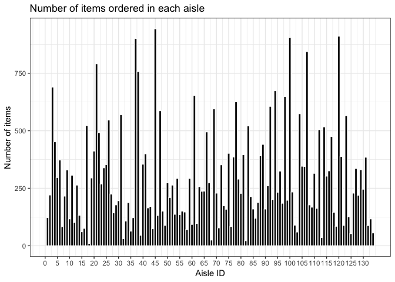

p8105\_hw3\_kz2334
================
Kangkang Zhang
10/8/2018

Problem 1
---------

Load required packages.

``` r
library(tidyverse)
```

    ## ── Attaching packages ──────────────────────────────────────────────────────────── tidyverse 1.2.1 ──

    ## ✔ ggplot2 3.0.0     ✔ purrr   0.2.5
    ## ✔ tibble  1.4.2     ✔ dplyr   0.7.6
    ## ✔ tidyr   0.8.1     ✔ stringr 1.3.1
    ## ✔ readr   1.1.1     ✔ forcats 0.3.0

    ## ── Conflicts ─────────────────────────────────────────────────────────────── tidyverse_conflicts() ──
    ## ✖ dplyr::filter() masks stats::filter()
    ## ✖ dplyr::lag()    masks stats::lag()

``` r
devtools::install_github("p8105/p8105.datasets")
```

    ## Skipping install of 'p8105.datasets' from a github remote, the SHA1 (21f5ad1c) has not changed since last install.
    ##   Use `force = TRUE` to force installation

``` r
library(p8105.datasets)
```

------------------------------------------------------------------------

Load the BRFSS data and do some data cleaning.

``` r
data(brfss_smart2010)
brfss_data = brfss_smart2010 %>% 
  janitor::clean_names() %>% 
  filter(topic == "Overall Health", response %in% c("Excellent", "Very good", 
                                                  "Good", "Fair", "Poor")) %>% 
  mutate(response = factor(response, ordered = TRUE, levels = 
                          c("Poor", "Fair", "Good", "Very good", "Excellent")))
```

------------------------------------------------------------------------

Find out which states were observed at 7 locations in 2002.

``` r
brfss_data %>% 
  distinct(locationdesc, locationabbr, year) %>% 
  count(locationabbr, year) %>% 
  filter(year == 2002, n == 7)
```

    ## # A tibble: 3 x 3
    ##   locationabbr  year     n
    ##   <chr>        <int> <int>
    ## 1 CT            2002     7
    ## 2 FL            2002     7
    ## 3 NC            2002     7

CT, FL NC were observed at 7 locations in 2002. It shows that the program had great attention to those three states in 2002.

------------------------------------------------------------------------

Make a “spaghetti plot” that shows the number of locations in each state from 2002 to 2010.

``` r
brfss_data %>% 
  group_by(locationabbr, year) %>% 
  summarise(n = n_distinct(locationdesc)) %>% 
ggplot(aes(y = n, x = year, color = locationabbr)) + 
  geom_line() + 
  labs(
    title = "spaghetti plot",
    x = "Year",
    y = "Number of Locations"
  ) +
  theme_bw() + 
  viridis::scale_color_viridis(
    name = "State", 
    discrete = TRUE
  ) 
```


We can see that the numbers of locations in majority of states fluctuated within \[0, 10\] from 2002 to 2010. There was a state with number less than 10 in 2006, then rapidly grow up to larger than 40 in 2007.

------------------------------------------------------------------------

Make a table showing, for the years 2002, 2006, and 2010, the mean and standard deviation of the proportion of “Excellent” responses across locations in NY State.

``` r
brfss_data %>%
  filter(year %in% c(2002, 2006, 2010), locationabbr == "NY") %>% 
  group_by(year, response) %>% 
  summarise(mean = mean(data_value),
            standard_deviation = sd(data_value)) %>% 
  filter(response == "Excellent") %>% 
knitr::kable(digits = 2)
```

|  year| response  |   mean|  standard\_deviation|
|-----:|:----------|------:|--------------------:|
|  2002| Excellent |  24.04|                 4.49|
|  2006| Excellent |  22.53|                 4.00|
|  2010| Excellent |  22.70|                 3.57|

The mean of proportion of "Excellent" Response in locations in NY varied a little among those years. The standard deviation of "Excellent" Response in locations in NY were almost the same among those years.

------------------------------------------------------------------------

Make a five-panel plot that shows the average proportion in each response category for each year and each state.

``` r
brfss_data %>% 
  group_by(year, locationabbr, response) %>% 
  summarise(mean_proportion = mean(data_value, na.rm =TRUE)) %>% 
ggplot(aes(y = mean_proportion, x = year, color = locationabbr)) + 
  geom_line(show.legend=F) + 
  labs(
    title = "panel plot category by response",
    x = "Year",
    y = "Proportion of Response"
  ) +
  facet_grid( ~ response) + 
  theme_bw() + 
  viridis::scale_color_viridis(
    name = "State", 
    discrete = TRUE)
```


We can see from the plot that globally, "Very Good" has the largest proportion among those response. The distribution of proportion of "Good" is very close to the distribution of "Very Good". The proportion of "Excellent" has median value among them. The proportion of "Poor" is the least among them.

Problem 2
---------

Load the instacart data and do some data cleaning.

``` r
data(instacart)
instacart_data = instacart %>% 
  janitor::clean_names() 

instacart_data
```

    ## # A tibble: 1,384,617 x 15
    ##    order_id product_id add_to_cart_ord… reordered user_id eval_set
    ##       <int>      <int>            <int>     <int>   <int> <chr>   
    ##  1        1      49302                1         1  112108 train   
    ##  2        1      11109                2         1  112108 train   
    ##  3        1      10246                3         0  112108 train   
    ##  4        1      49683                4         0  112108 train   
    ##  5        1      43633                5         1  112108 train   
    ##  6        1      13176                6         0  112108 train   
    ##  7        1      47209                7         0  112108 train   
    ##  8        1      22035                8         1  112108 train   
    ##  9       36      39612                1         0   79431 train   
    ## 10       36      19660                2         1   79431 train   
    ## # ... with 1,384,607 more rows, and 9 more variables: order_number <int>,
    ## #   order_dow <int>, order_hour_of_day <int>,
    ## #   days_since_prior_order <int>, product_name <chr>, aisle_id <int>,
    ## #   department_id <int>, aisle <chr>, department <chr>

Instacart dataset tells imformation about transactions of online grocery shopping.

-   The size of the dataset is (1384617, 15).
-   It contains integer and chracter variables.
-   There are 131209 unique orders.
-   59.86% of products were not bought for the first time.
-   The maximum times of orders for one person is 100.

------------------------------------------------------------------------

Find out how many aisles are there, and which aisles are the most items ordered from.

``` r
instacart_data %>% 
  group_by(aisle_id, aisle) %>% 
  summarise( n = n_distinct(product_id)) %>% 
  arrange(desc(n))
```

    ## # A tibble: 134 x 3
    ## # Groups:   aisle_id [134]
    ##    aisle_id aisle                   n
    ##       <int> <chr>               <int>
    ##  1       45 candy chocolate       943
    ##  2      120 yogurt                911
    ##  3      100 missing               905
    ##  4       37 ice cream ice         901
    ##  5      107 chips pretzels        844
    ##  6       21 packaged cheese       791
    ##  7       38 frozen meals          757
    ##  8        3 energy granola bars   690
    ##  9       94 tea                   674
    ## 10       61 cookies cakes         654
    ## # ... with 124 more rows

There are 134 aisles, and most items ordered, whose number is 943, are from candy chocolate. Top 3 items, lucluding chocolate, yogurt and ice cream, are all desserts.

------------------------------------------------------------------------

Make a plot that shows the number of items ordered in each aisle.

``` r
instacart_data %>% 
  distinct(product_id, aisle_id, aisle) %>% 
  ggplot(aes(x = aisle_id)) +
  geom_histogram( bins = 134, fill = "black", color = "white") +
  scale_x_continuous(breaks = seq(0, 134, 5)) +
  labs(
    title = "Number of items ordered in each aisle",
    x = "Aisle ID",
    y = "Number of items"
  ) +
  theme_bw()
```



The number of items ordered in each aisle varied a lot. The maximum almost reachs 1000, while the minimum is close to zero.

------------------------------------------------------------------------

Make a table showing the most popular item aisles “baking ingredients”, “dog food care”, and “packaged vegetables fruits”.

``` r
instacart_data %>% 
  group_by(aisle, product_name) %>% 
  summarise( n = n()) %>% 
  filter(min_rank(desc(n)) < 2, aisle %in% c("baking ingredients", 
                                        "dog food care", "packaged vegetables fruits")) %>% 
  knitr::kable(digits = 0)
```

| aisle                      | product\_name                                 |     n|
|:---------------------------|:----------------------------------------------|-----:|
| baking ingredients         | Light Brown Sugar                             |   499|
| dog food care              | Snack Sticks Chicken & Rice Recipe Dog Treats |    30|
| packaged vegetables fruits | Organic Baby Spinach                          |  9784|

In “baking ingredients”, Light Brown Sugar is the most popular product. In “packaged vegetables fruits”, Organic Baby Spinach is the most popular, ordered by 9784 times. The most popular product in “dog food care” was only ordered by 30 times.

------------------------------------------------------------------------

Make a table showing the mean hour of the day at which Pink Lady Apples and Coffee Ice Cream are ordered on each day of the week.

``` r
instacart_data %>%
  group_by(order_dow, product_name) %>% 
  filter(product_name %in% c(
    "Pink Lady Apples", "Coffee Ice Cream")) %>% 
  summarise(mean_hour = mean(order_hour_of_day, rm.na = TRUE)) %>% 
  spread(key = order_dow, value = mean_hour) %>% 
  knitr::kable(digits = 1)
```

| product\_name    |     0|     1|     2|     3|     4|     5|     6|
|:-----------------|-----:|-----:|-----:|-----:|-----:|-----:|-----:|
| Coffee Ice Cream |  13.8|  14.3|  15.4|  15.3|  15.2|  12.3|  13.8|
| Pink Lady Apples |  13.4|  11.4|  11.7|  14.2|  11.6|  12.8|  11.9|

Coffee Ice Cream was most ordered on Tuesday, while Pink Lady Apples was most ordered on Wednesday.
